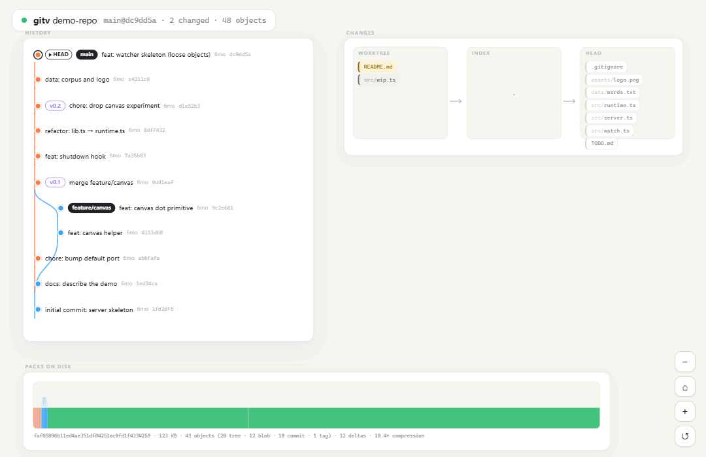
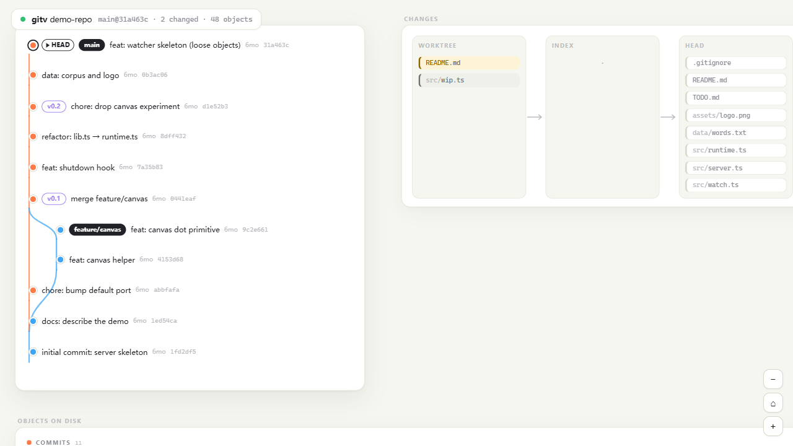
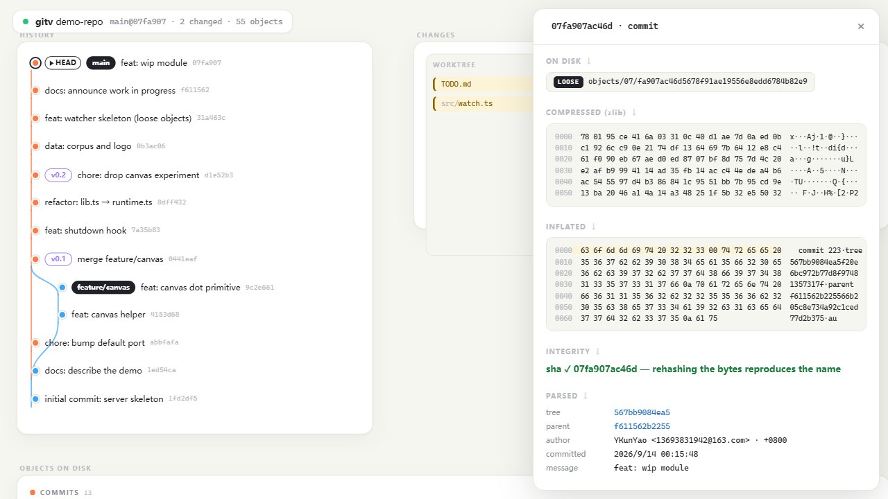
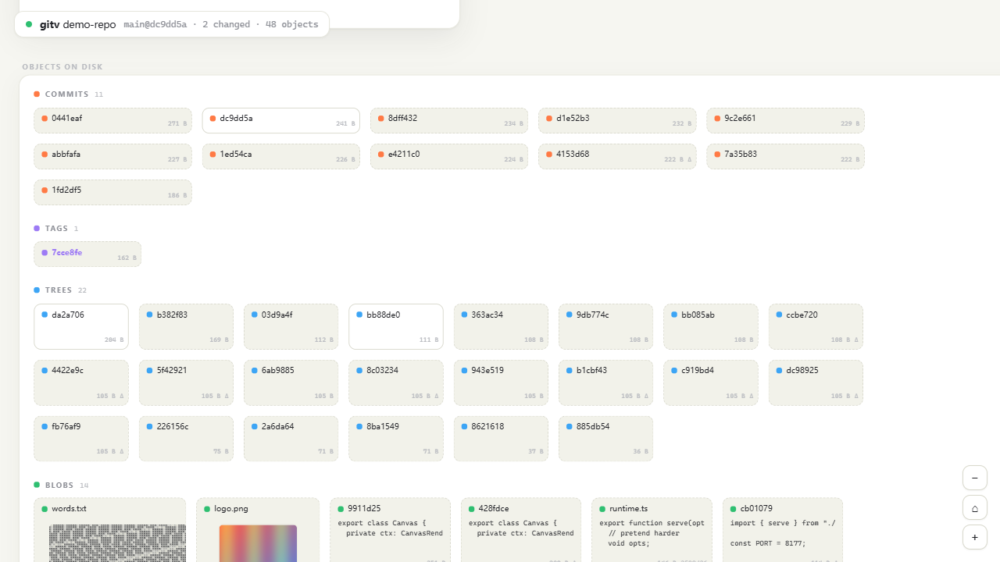
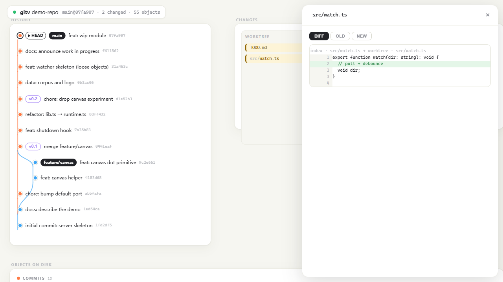
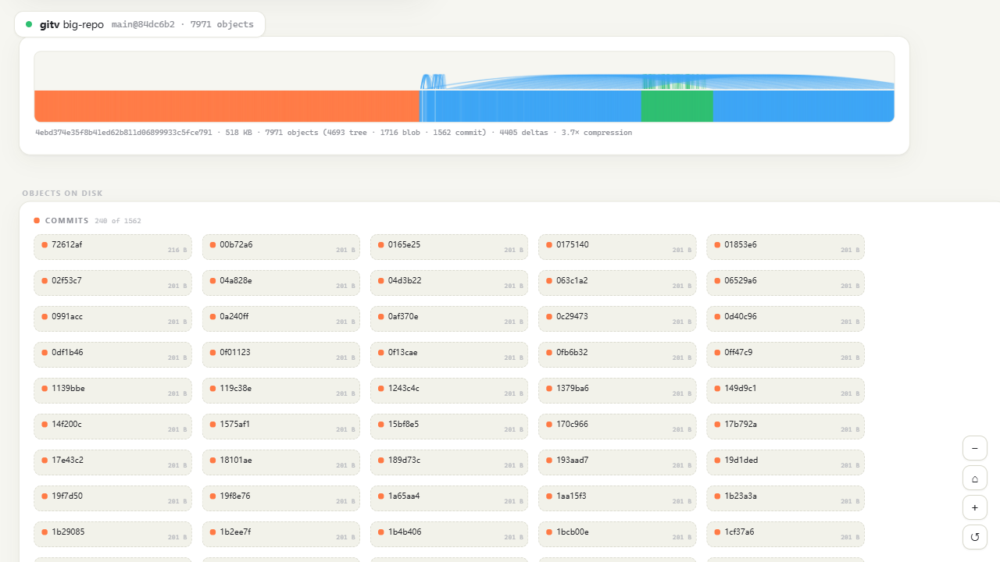
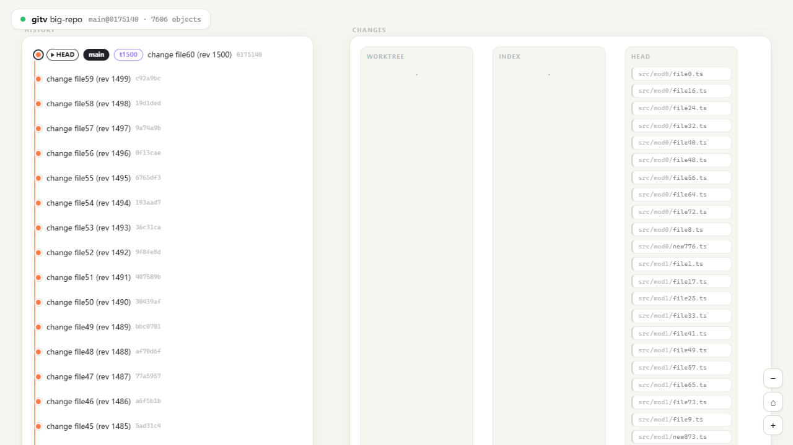

# gitv

**See your `.git` — every byte, every object, live.**

gitv is a git repository visualizer that refuses to treat `.git` as a black
box. It reads the real files on disk — loose objects, packfiles, the index,
refs — parses them **byte by byte** with its own parsers (no libgit2, no
shelling out for object data), lays the whole object database out in a bright,
draggable scene, and then watches the repository: when you commit, branch,
stage, or rewrite history, the scene animates the change as it happens.

<p align="center">
  
</p>

<p align="center">
  
</p>

English | [中文说明](README.zh-CN.md)

## What you see

- **HISTORY** — the commit graph with real lane routing, branch / tag / HEAD
  pills, merge curves, relative timestamps, and dashed stubs where history is
  truncated. Hover a commit to light up its ancestry edges; drag any commit
  and the edges follow.
- **CHANGES** — the `worktree → index → HEAD` flow, exactly as git status sees
  it. Chips move between columns as you edit, `git add`, and commit. Click a
  chip for a content diff between the two states that differ.
- **OBJECTS ON DISK** — every object in the database, grouped by type, sized
  by content. Loose objects are clean white cards; packed objects carry a
  dashed border and a darker fill. Text blobs show their first lines, images
  render as thumbnails, large and binary blobs are woven into a byte tapestry
  (one cell per byte, colored by value class).
- **PACKS ON DISK** — each packfile drawn as it lies on disk: one block per
  object at its real byte offset, sized by compressed size, colored by type,
  with arcs linking every delta to its base. Hover a block and its whole
  delta family lights up while the rest fades; click to inspect. The caption
  line reads out size, census, delta count and compression ratio.
- **Inspector** — click any object and read the parsing story top to bottom:
  where the bytes live → the zlib stream → the inflated `type size\0` header →
  the parsed payload → an integrity check that re-hashes the bytes and
  reproduces the object's name. Hovering a parsed field highlights the exact
  bytes it was read from; delta objects show their full chain, hop by hop,
  down to the base.

<p align="center">
  
</p>

<p align="center">
  
</p>

<p align="center">
  
</p>

<p align="center">
  
</p>

## Live

gitv watches the worktree *and* `.git`. Commit, branch, stage, stash, amend,
run `git gc` — the scene diffs the new model against the old one and animates
only what changed: commits pop in, ref pills slide along the graph, chips hop
between columns, new objects flash in the field. A `git gc` that rewrites the
entire pack mid-flight just works. The connection dot in the HUD is the SSE
heartbeat.

## Made for questions

- **What exactly changed in this commit?** Every commit lists its changed
  files (hand-rolled diff-tree against the first parent); click one for the
  line diff.
- **What is inside this commit?** Inspecting one dims every object it
  doesn't contain — its tree and blobs stay lit in the field.
- **Where is that file / commit / object?** Press `/` (or Ctrl+K) and type a
  path, sha prefix, branch or subject; Enter jumps the camera there.
- **Was this blob stored as a delta?** Delta objects show their chain —
  every hop's sha, type and sizes — down to the solid base.

<p align="center">
  
</p>

## Run it

Requires [Bun](https://bun.sh) ≥ 1.1 and `git` on PATH.

```sh
bun run src/cli.ts serve path/to/repo          # opens http://localhost:8177
bun run src/cli.ts serve . --port 9000 --no-open
bun run src/cli.ts --help
```

From a checkout of gitv itself:

```sh
bun run demo      # builds demo-repo/ — a repo with everything worth looking at
bun test          # parsers verified against git's own output
bun x tsc --noEmit
bun run scripts/record.ts   # records docs/live.gif
bun run compile   # single-file executable → dist/gitv(.exe)
```

`bun run compile` bakes the frontend into one standalone binary (frontend
assets embedded, git and Bun runtime included) — copy it anywhere and run
`gitv serve <repo>` with nothing else installed.

## How it works

Everything in `src/parse/` is a from-scratch binary parser, tested against
git itself (`cat-file`, `verify-pack`, `ls-files`, `for-each-ref`) on a real
fixture repository:

| piece            | what it reads                                                   |
| ---------------- | --------------------------------------------------------------- |
| `loose.ts`       | `objects/xx/yyy…` → zlib inflate → `<type> <size>\0` payload    |
| `pack.ts`        | `.idx` v2 fanout/SHA/offset tables, pack entry headers, ofs/ref delta chains, copy/insert delta instructions |
| `indexfile.ts`   | `.git/index` (DIRC) v2/v3/v4, extensions, trailing checksum     |
| `refs.ts`        | `HEAD`, loose refs, `packed-refs` with peeled annotations       |
| `objects.ts`     | commit / tree / annotated-tag payloads, with per-field byte ranges |
| `diff.ts`        | Myers line diff with prefix/suffix trimming                     |

The scanner (`src/scan/repo.ts`) assembles a full `RepoModel` from those
bytes — every object's type, size, and storage (loose file or pack+offset) —
and diffs consecutive models into events. The server (`src/server.ts`) serves
the model, on-demand parse stages, raw bytes, per-commit diffs, and an SSE
stream; the frontend (`web/`) renders and animates.

`git status` (porcelain v2) and, on huge repositories, `git rev-list` are the
only places gitv borrows the git CLI — for change classification and history
truncation, never for object data.

## Notes & limits

- SHA-1 repositories are fully supported; SHA-256 works for loose objects,
  index and refs (packs with 32-byte entries are parsed but less battle-tested).
- Pack index v1 (pre-2006) is not supported.
- The whole pack is mapped in memory (≤ 160 MB per pack; larger packs fall
  back to positioned reads).
- Windows / macOS support recursive `fs.watch`; on Linux gitv falls back to
  polling for directories that don't support it.

## License

MIT — see [LICENSE](LICENSE).
